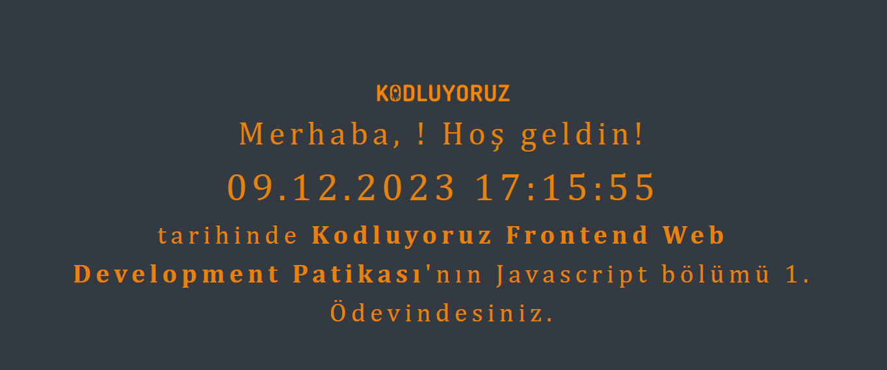

# Clock Assignment

This project encompasses the first assignment of the Kodluyoruz Frontend Web Development Path's JavaScript section. It includes a clock application displaying a welcome message with the user's name, the current date and time, and information about the assignment.

## Features

- Welcome message containing the user's name entered through a prompt.
- Real-time date and time display.
- Information about the Kodluyoruz Frontend Web Development Path JavaScript assignment.

## Usage

1. Open the `index.html` file in your web browser.
2. Enter your name when prompted on the page.
3. Observe the welcome message, clock display, and assignment information.

## Additional Information

- The clock display updates every second.
- This project covers the first assignment of the Kodluyoruz Frontend Web Development Path JavaScript section.

## Screenshots

## License

This project is licensed under the [MIT License](LICENSE).
